# Object-Oriented JavaScript

> <https://classroom.udacity.com/courses/ud015>

## Scope 作用域

* Lexical Scope：作用域 就是函数可以调用的范围 **js 比较特殊 可以调用外围的 global 变量  不用特别声明 global**
* Execution Contexts 执行环境 就是变量的存储机制 寻找变量值的过程是从内向外的

## Closures 闭包

* the function can remain the available after outer scopes have returned
* 即使跳出当前函数的作用域 依然保留了访问之前临时变量的机制

## Keywords "this"  

* "this" 的调用 感觉像是 python 里面的 self  不过，这个机制真的有点晕
* 一般就是看“.”前面的内容
* 然而单独赋值也会重写
* 注意 setTimeout 的调用 直接赋值 global 了

## The object prototype 对象继承的特性

* 和 python 的 类的继承 很像  都继承了 prototype
* `var new_object = Objdect.creat(old_object)`

## Object Decorator Pattern 对象 装饰器 模式

* 代码的重复利用

图例
*变量*--*variable * --`var amy`
*对象* -- *object* -- `{ }`
~~属性~~ -- ~~proprietary~~ -- 


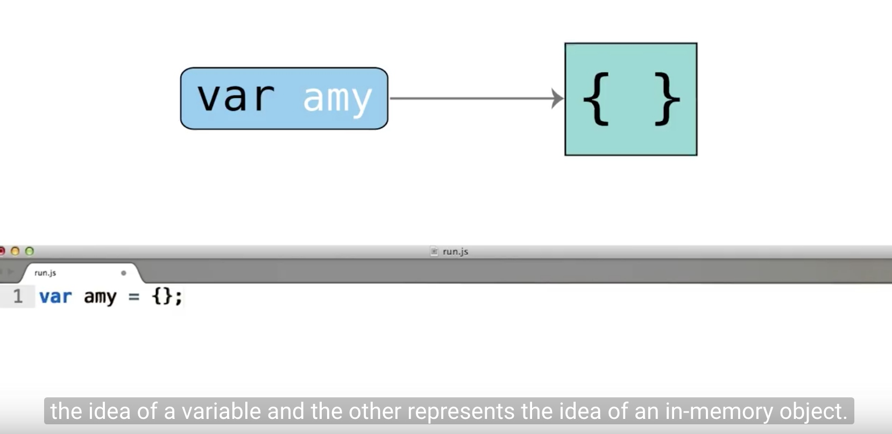
`var amy = {}`    amy 是 *变量*   { } 是内存中的 **对象** object   变量是指向对象的


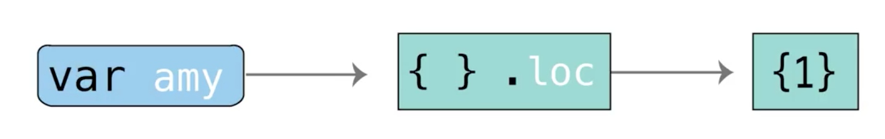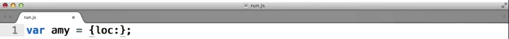
**对象**`{ }` 拥有一个  ~~属性~~  `.loc` 这个 ~~属性~~ 也指向了一个**对象** `{1}`

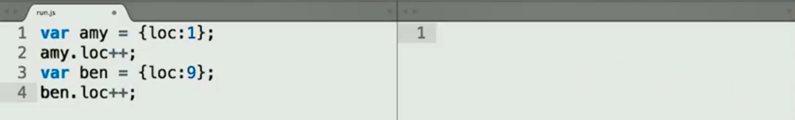

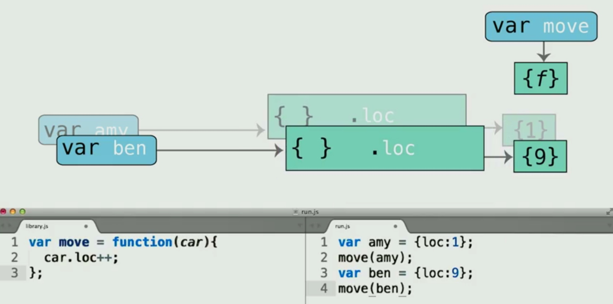
在另外的文件夹中 声明了一个 *变量variable* `var move` 存放了一个 **对象object** 这个对象是个 **函数对象**


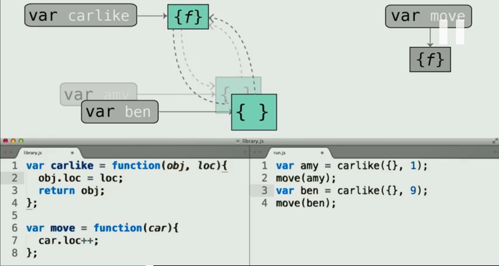

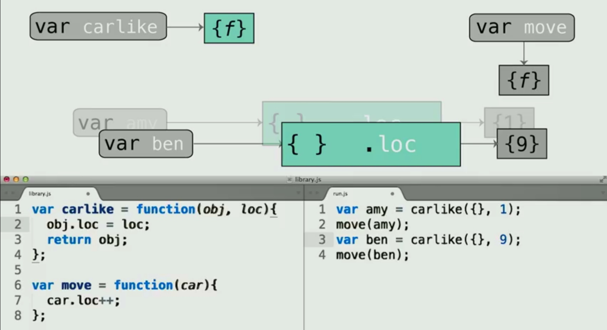

现在 我们有了一个装饰器函数来给**对象**  附加 ~~属性~~
我们将**对象 **和 即将成为属性的 **对象** 打包 一起传给 装饰器函数 输出的 是一个**带属性的对象**


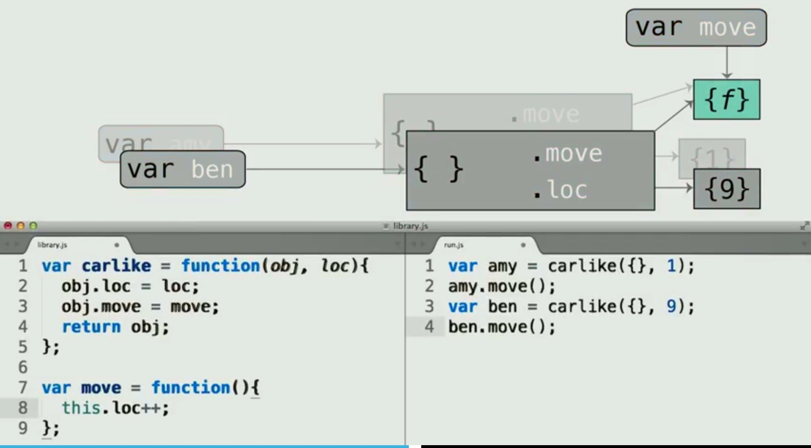
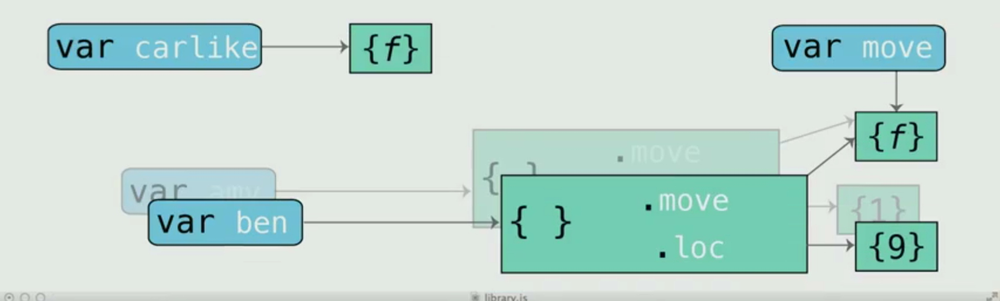
其实 **函数对象** 也可以作为一种~~属性~~
现在 变量里的**对象** 带着 **位置对象**`{9}`  **函数对象**`move`   在`{f}`里面滚了一圈   然后 一起打包固定在了 本体这个**对象**上
这张图其实是有点问题的  这个对象的方法其实是通过访问变量 `var move` 访问到的 函数 {f}

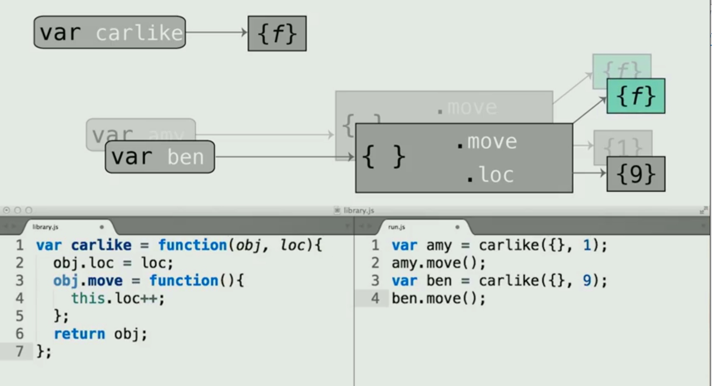
 现在因为没给函数  找个变量存放  所以每次调用 `var carlike` 存放的这个函数 都要重新生成一个没有名字的函数，作为这个对象的属性
* 可以牺牲部分内存，获取代码的 可读性

## Functional Classes 


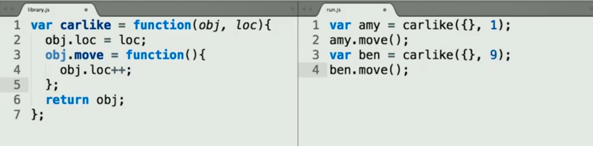

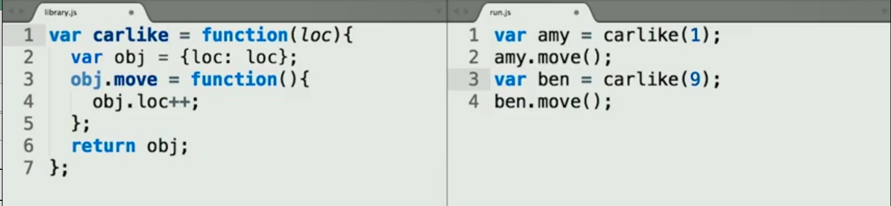
对比 装饰器decorator 模式 和  Functional Class 模式  class 模式 类的实例生成不再接受对象作为参数传进来，而是直接生成了一个 local **object**  `obj`

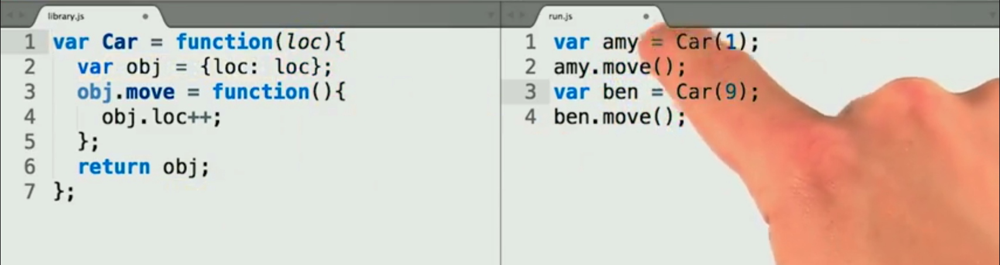
几个概念
* 构造函数 Constructor function
* 类 Class 
* 实例 Instansce 通过构造函数生成的对象

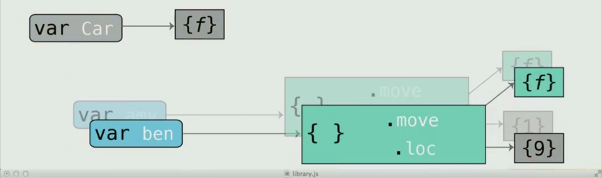
不再传入对象的时候，我们的实例对象，又都指向了同一个是`obj`生成的，感觉这个 `obj` 就是 global 继承的机制
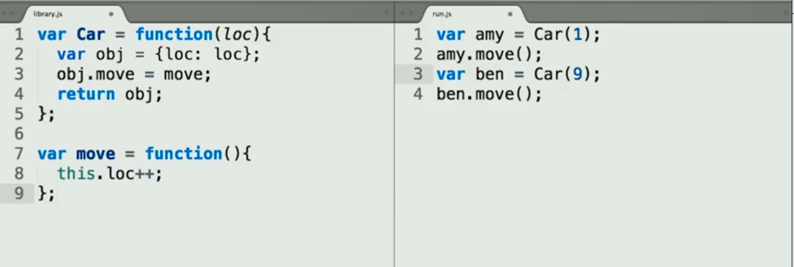
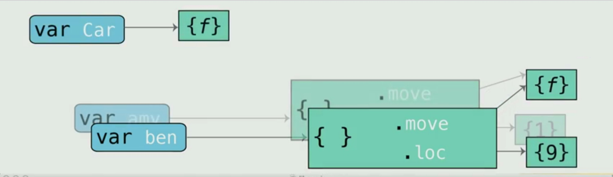


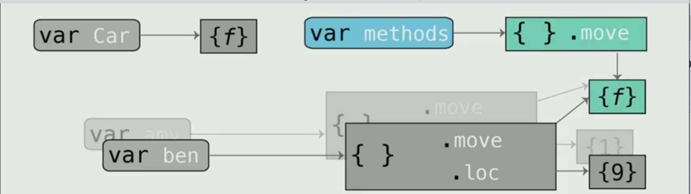

```javascript
var Car = fucntion(loc){
    var obj = {loc: loc};
    extend(obj, methods);
    return obj;
};
var methods = {
    move : fucntion(){
        this.loc++;
    },
    on : fuction( )){/*...*/},
    off : fuction( )){/*...*/}
}
```
同时我们为了，减少生成函数的数量，还是把函数单独找了个容器装起来了

* 类的声明 可以和类的方法 声明分开 防止函数被忘了 简单点说，还是要找个变量容器，把这些类的方法都装起来
* 
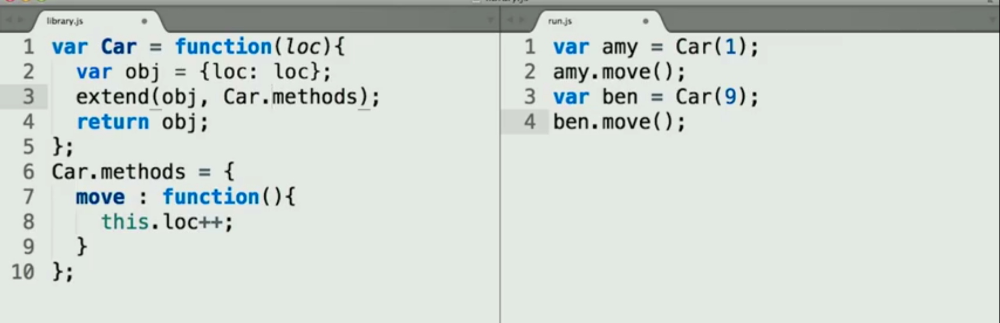
再进一步 ，为了让这个方法的容器 和 类 练习的更紧密， 我们找了一个类的属性 来作为所有方法的容器
还是那句老话 实际上 **属性和函数起到的作用是一样的 只不过属性只能传固定的参数**

